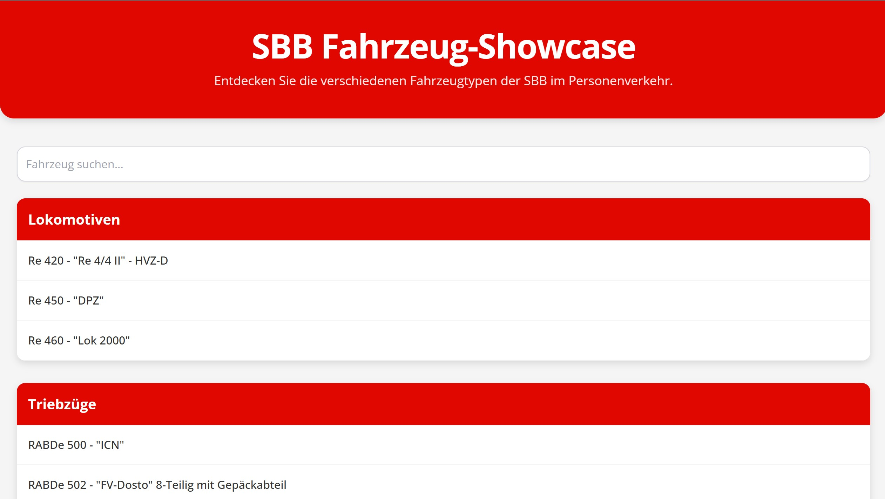
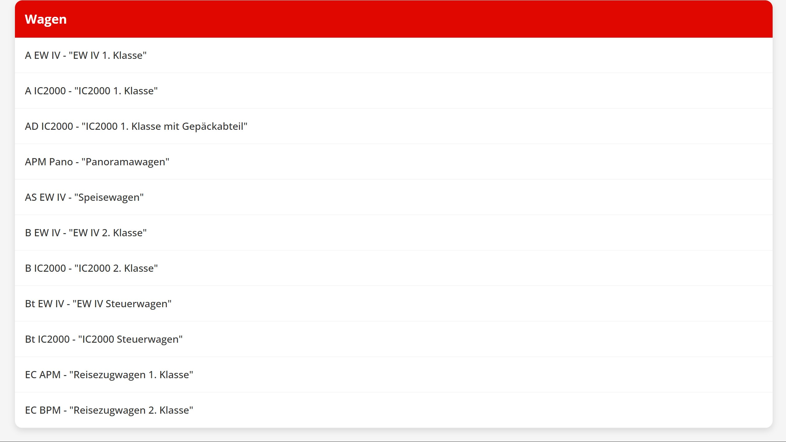

# 🚆 sbb_showcase

An interactive web application built with **Java** and **HTML** to showcase the passenger train fleet of the Swiss Federal Railways (SBB).  
It provides a visual and structured way to explore SBB’s rolling stock, from high-speed trains like the **Giruno** to regional workhorses like the **FLIRT**.

---

## ✨ Features
- Visual overview of SBB passenger trains  
- Train details such as type, service role, and classification  
- Organized gallery-style presentation  
- Easy to extend with new models  

---

## 🛠️ Technologies
- **Java** – application logic  
- **HTML / CSS** – frontend design  
- **JavaScript** for interactivity  

---

## 📖 Background
This project reflects my personal passion for trains and the Swiss railway system.  
As someone fascinated by the variety of rolling stock operated by SBB, I wanted to create a digital showcase that highlights their unique designs and roles in the network.  
From the sleek **Giruno** that connects Switzerland to Italy at high speed, to the versatile **RABe 511 KISS** that powers the Zürich S-Bahn, and the **FLIRT** serving regional routes across the country. Each train tells part of the story of Swiss mobility.

For official information about the fleet:  
- [SBB – Our Trains](https://www.sbb.ch/en/travel-information/services-on-train/our-trains.html)  
- [SBB Rolling Stock Statistics](https://reporting.sbb.ch/en/rolling-stock)

---

## 📷 Screenshots

---

## 👤 Author
Created by [m4rv1n33](https://github.com/m4rv1n33)  
A project combining programming with a lifelong enthusiasm for Swiss trains 🚆
